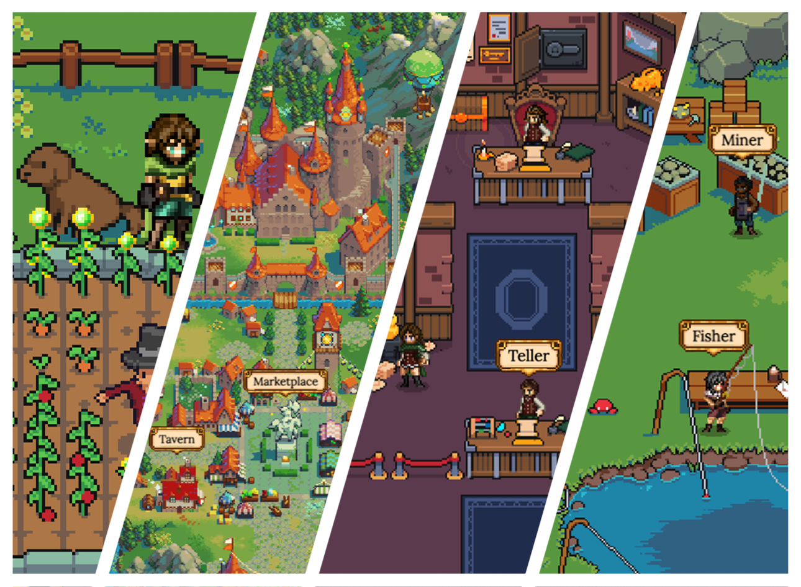

# Defi Kingdoms

## Introduzione

DeFi Kingdoms è un gioco, un DEX, un'opportunità di pool di liquidità, un mercato di NFT, e tutto si svolge perfettamente nella forma incredibilmente nostalgica della pixel art fantasy. Siamo entusiasti di rilasciare l'universo di DeFi Kingdom al mondo. Vieni a far parte della nostra adorabile community!

### La motivazione per la creazione di DeFi Kingdoms

Siamo grandi fan dell'innovazione che sta accadendo nella DeFi e nella tecnologia blockchain in generale, ma stavamo aspettando un progetto DeFi per abbracciare davvero il pieno potenziale della blockchain in forma di gioco. Investire e ottenere quei dolci ritorni e sfruttare il rialzo di prezzo di alcune coin è senza dubbio divertente, ma perché non può essere tutto in forma di gioco? Perché non possiamo costruire qualcosa e aumentarlo di livello per aumentare i guadagni? Perché non possiamo fare missioni giornaliere per raccogliere NFT rari che effettivamente aumentano e influiscono sui premi e sui ritorni? Una volta deciso che doveva essere costruito, siamo passati a capofitto nella produzione ed è nato DeFi Kingdoms!

### Un team dedicato e una visione condivisa

Volevamo un dex che permettesse ai possessori non solo di detenere una criptovaluta, ma di possederne una che sia utilizzabile, preziosa e che faccia guadagnare i possessori in molti modi divertenti. Abbiamo confezionato elementi DeFi in un gioco divertente e sinergico, fornendo ai possessori di token JEWEL un'esperienza coinvolgente e significativa. Siamo qui per il lungo termine, pianificando le funzionalità per le fasi a venire e alcune un po' più avanti per impostare questa community e proiettarci verso la massima magnificenza. :)
