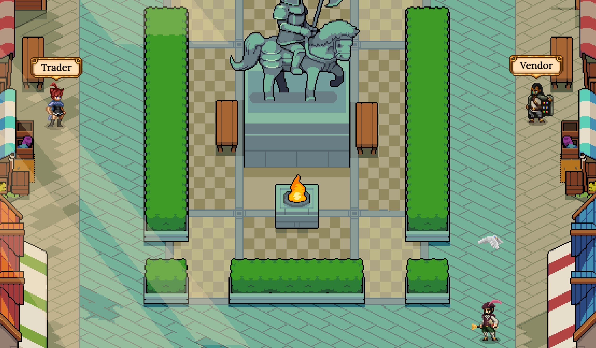

# Exchange Decentralizzato

Al suo centro, DeFi Kingdoms ha un Exchange Decentralizzato (DEX) che utilizza il collaudato protocollo UniswapV2. Investire è uno dei motivi principali per cui siamo attratti dalla tecnologia blockchain e vogliamo rendere l'esperienza di investimento divertente e piacevole per tutti nel Regno.&#x20;

**Il Team di sviluppo ha impegnato circa $ 15k di ONE per fornire la liquidità iniziale su ONE/JEWEL.**

Nel Marketplace, puoi scambiare i tokens ai tassi di cambio correnti. Puoi anche diventare un fornitore di liquidità aggiungendo liquidità (LP) a qualsiasi pool che desideri. Questi ti farà guadagnare commissioni ogni volta che qualcuno scambia quei token. In alternativa, questi token LP possono anche essere depositati nei Gardens per guadagnare premi in JEWEL**.**

Un'altra caratteristica unica offerta da DeFi Kingdoms è la Bank, dove puoi depositare token JEWEL per ricevere tokens xJEWEL. La Bank riceverà commissioni dal DEX e periodicamente effettuerà un acquisto di mercato per tokens JEWEL, il che significa che i tuoi xJEWEL varranno sempre più JEWEL rispetto a quanti ne metti! **Inoltre, ogni transazione in-game di JEWEL depositerà una percentuale nella Banca per premiare ulteriormente i possessori di xJEWEL.**
