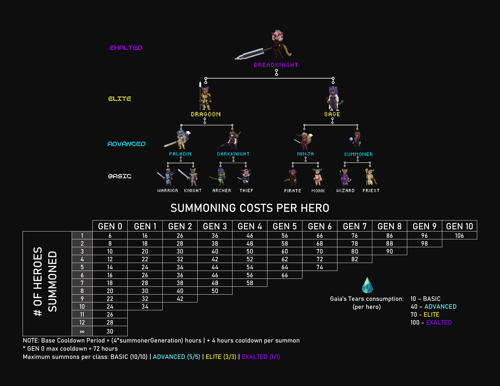

# Summoning

Per Evocare, due Eroi devono visitare l'**Arch Druid** ed infondere un **Cristallo Evocativo** con la loro essenza combinata. I Cristalli Infusi vengono quindi utilizzati al [Portale](../portal.md) per cercare Eroi da terre lontane che sono in sintonia con gli Eroi che hanno infuso il cristallo.

Per infondere un cristallo, gli Eroi riversano la loro energia nelle **Gaia's Tears** e nei **JEWEL**, che vengono poi alimentati in un Cristallo Evocativo. Gli Eroi più forti possono usare Gaia's Tears addizionali per far sì che il portale cerchi Eroi più forti più simili all'evocatore.

NOTA: gli Eroi evocati sono troppo simili agli Eroi che li hanno evocati per essere in grado di infondere correttamente un nuovo Cristallo di Evocazione. Questo vale anche per coppie di Eroi Evocati da uno o due degli stessi Eroi. Tutte le altre combinazioni di Eroi non incontreranno alcun problema nell'infondere un nuovo Cristallo di Evocazione fintanto che hanno evocazioni rimanenti.

**Per ogni 5 livelli raggiunti**, l'Eroe evocatore, può aumentare il costo di evocazione in **Gaia's Tears** di 10 per fornire bonus all'Eroe evocato. Questi bonus vengono applicati alle Statistiche dell'Eroe evocato, alla crescita delle statistiche primarie e alla crescita delle statistiche secondarie. I bonus si basano sulle prime tre statistiche rilevanti dell'Eroe evocatore, ed entrambi gli Eroi evocatori possono fornire i propri bonus se spendono Tears extra.

I bonus si ripetono secondo il seguente schema con ogni step aumentato di +10 Tears pagate per ogni Eroe evocato:

1. \+(1 + loopCount) per corrispondere alle statistiche più alte dell'Eroe evocatore
2. \+(1 + loopCount)% al tasso di crescita delle statistiche primarie della statistica più alta dell'Eroe evocatore
3. \+(2 + loopCount)% al tasso di crescita delle statistiche secondarie della statistica più alta dell'Eroe evocatore
4. \+(1 + loopCount) per stat corrispondente alla seconda statistica più alta dell'Eroe evocatore
5. \+(1 + loopCount)% al tasso di crescita delle statistiche primarie corrispondente alla seconda statistica più alta dell'Eroe evocatore
6. \+(2 + loopCount)% al tasso di crescita delle statistiche secondarie corrispondente alla seconda statistica più alta dell'Eroe evocatore
7. \+(1 + loopCount) per stat corrispondente alla terza statistica più alta dell'Eroe evocatore
8. \+(1 + loopCount)% al tasso di crescita delle statistiche primarie corrispondente alla terza statistica più alta dell'Eroe evocatore
9. \+(2 + loopCount)% al tasso di crescita delle statistiche secondarie corrispondente alla terza statistica più alta dell'Eroe evocatore

In queste formule, loopCount indica il numero di volte in cui i bonus sono tornati al passaggio 1 (questo accade a +100 e +190 Tears aggiunte). Quindi la seconda volta, al passaggio 1 il bonus aggiunto sarebbe +2 alla statistica più alta dell'Eroe evocatore, e così via.

Esempi:\
LVL30 Wizard (statistiche più alte INT, WIS e LCK) paga 70 Gaia's Tears (base 10 + 60 per 6 step di 5 livelli) L'Eroe evocato riceve +1 a INT e WIS, +1% di crescita delle statistiche primarie a INT e WIS e +2% di crescita delle statistiche secondarie a INT e WIS

LVL100 Wizard (statistiche più alte INT, WIS e LCK) paga 210 Gaia's Tears (base 10 + 200 per 20 passaggi di 5 livelli) L'eroe evocato riceve +6 a INT, +3 WIS e +3 LCK, +6% statistica primaria crescita a INT, +3% a WIS e 3% a LCK e +5% di crescita statistica secondaria a INT, WIS e LCK

Questi bonus sono per ogni Eroe evocatore, quindi il massimo possibile per due Eroi LVL100 da spendere sarebbe 420 Gaia's Tears (base 10_2 + 200_2 extra)

Le **Pietre di Potenziamento (Enhancement Stones)** possono essere utilizzate durante questo processo per migliorare ulteriormente i parametri iniziali dell'Eroe evocato!

L'Evocazione è un processo estenuante e quell'esaurimento si aggrava ad Evocazione successiva. Per ogni Evocazione eseguita, un Eroe deve attendere un periodo di ricarica (Cool down) prima di poter evocare di nuovo. Il periodo di ricarica aumenta di quattro ore a ogni Evocazione, fino a un limite massimo. Il periodo di ricarica di base è di 4\*summonerGeneration ore. Inoltre, ad eccezione degli Eroi Gen0, tutti i nuovi Eroi evocati hanno un periodo di ricarica di 24 ore prima di poter evocare o essere venduti.

L'affaticamento causato dell'evocazione non termina solo con un tempo di recupero. La quantità di JEWEL necessaria a ciascun Eroe per infondere il Cristallo di Evocazione successivo aumenta di 2 JEWEL dopo ogni Evocazione. Gli Eroi Gen0 hanno il costo iniziale più basso per l'Evocazione (6 JEWEL) e ogni Generazione successiva vedrà un aumento di 10 JEWEL per Generazione nel costo delle loro Evocazioni rispetto alle Generazioni inferiori. L'incremento della fee di Evocazione per gli Eroi Gen0 finirà per raggiungere un prezzo inferiore a quello che le generazioni successive pagheranno per eseguire la loro evocazione finale.

Cosa, Come?! Sì, sfortunatamente solo gli Eroi Gen0 sono in grado di mantenere la loro energia evocativa. Tutte le generazioni successive hanno semplicemente un limite al numero di volte in cui possono concentrare le loro energie nelle Gaia's Tears. Una volta che hanno consumato l'ultima delle loro evocazioni, non possono più farne altre. Un'altra stranezza del processo di Evocazione è che il Portale cerca coloro che hanno energie evocative similei a quelle dell'Evocatore più debole. Quindi, se un Eroe evocatore Gen0 infonde un cristallo insieme ad un Eroe evocatore Gen1 con solo 4 evocazioni rimanenti, il Gen2 evocato sarà in grado di evocare solo 3 volte (lo stesso numero di evocazioni rimanenti dell'evocatore più debole dopo aver evocato questo nuovo eroe). Due evocatori Gen0 evocheranno un Gen1 con 10 summonings rimanenti

## Hero Ranks

Gli Eroi di grado superiore hanno iniziato ad arrivare nel Regno!!!

L'evocazione con eroi che hanno i geni appropriati può portare a una mutazione genetica che si traduce nell'evocazione di un eroe di grado più alto dal Portale. La tabella sopra mostra le combinazioni genetiche necessarie per Evocare ogni possibile classe di Eroe.

Heroes of higher rank have better starting stats and stat growth parameters than those of ranks below them. However, a side effect of their advanced abilities is that they require more Gaia's Tears to perform a Summon than Heroes of lower ranks. In addition, higher-ranked Heroes are more difficult for the Portal to have a chance to locate, so higher-ranked Heroes have lower maximum summons than lower-ranked ones. The chart above displays the Gaia's Tears requirements for higher-ranked and the maximum number of Summons that higher-ranked classes can receive on Summoning.

Basic - Warrior, Knight, Thief, Archer, Priest, Wizard, Monk, Pirate

Advanced - Paladin, Dark Knight, Summoner, Ninja

Elite - Dragoon, Sage

Exalted - DreadKnight

## Hero Rarity

The rarity level of a Summoned Hero is impacted by the rarity of the two Heroes used to infuse the Summoning Crystal.

The chart above illustrates the likelihood that pairing Heroes of given rarities will result in a Summoned Hero of a given rarity. For further information on this topic, visit the [Rarity](rarity.md) topic page.
