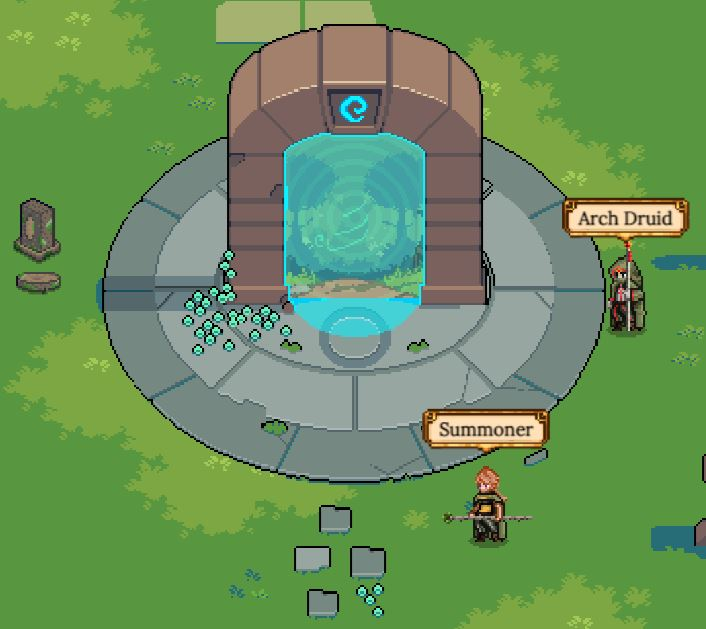
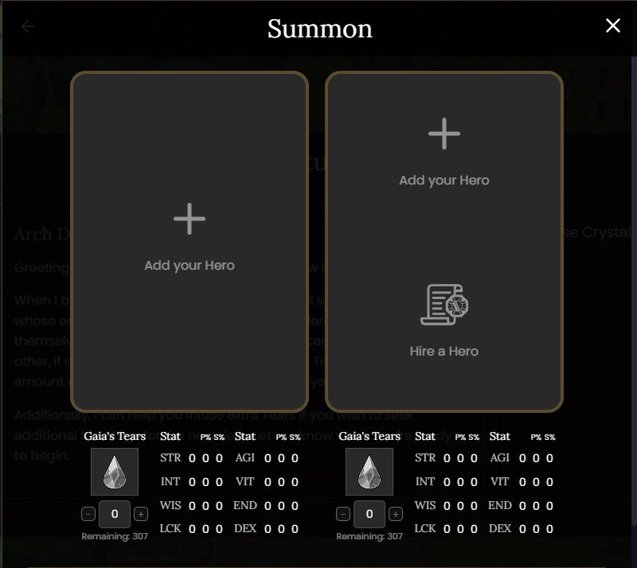

# Portal

Il **Portal** è il luogo in cui i nuovi [Eroi](heroes/) vengono **Evocati** dai meandri di Gaia.

L'[Evocazione](heroes/summoning.md) richiede due Eroi, la cui genetica influisce sulle fattezze dell'Eroe che emergerà. La Classe e la Sottoclasse di entrambi questi eroi, insieme alle loro [Statistiche](heroes/stats.md), [Rarità](heroes/rarity.md) e [Professione principale](professions/) vengono trasferite al nuovo Eroe, anche se possono verificarsi mutazioni che portano a risultati inaspettati!

Per evocare, devi possedere almeno un Eroe. Il secondo può essere noleggiato da un altro giocatore o può essere un altro Eroe che possiedi. L'interfaccia dell'**Arch Druid** ti consente di selezionare questi Eroi, oltre a spendere risorse aggiuntive per aumentare le statistiche del nuovo Eroe evocato (disponibile solo quando gli Eroi evocatori sono di livello 5 o  superiore).

Il costo dell'Evocazione è determinato dalla Generazione dell'Eroe evocatore, insieme a quante volte è stato evocato prima. Inoltre, il numero minimo di **Gaia's Tears** è determinato dal rango degli Eroi evocatori. I costi di Evocazione aumentano per le Generazioni superiori e con ogni Evocazione eseguita da ogni singolo Eroe.

Una volta selezionati gli Eroi e aggiunte eventuali **Gaia's Tears** o **Enhancement Stones** aggiuntive, l'Arch Druid fornirà un **Cristallo Infuso** che potrai portare al **Summoner** per aprirlo. Una volta aperto il Cristallo, potrai vedere il tuo nuovo Eroe attraversare il Portale in tutta la sua gloria!

Dovresti essere consapevole del fatto che tutti gli Eroi hanno un limite di Evocazioni disponibile, fatta eccezione per gli Eroi di Generazione 0. Inoltre, gli Eroi hanno un tempo di recupero dopo l'Evocazione che aumenta con ogni Evocazione successiva. Ulteriori dettagli sull'Evocazione, tra cui la ripartizione dei costi, gli alberi delle Classi e le probabilità di Rarità, possono essere trovati nella pagina principale dell'argomento dell'[Evocazione](heroes/summoning.md).
