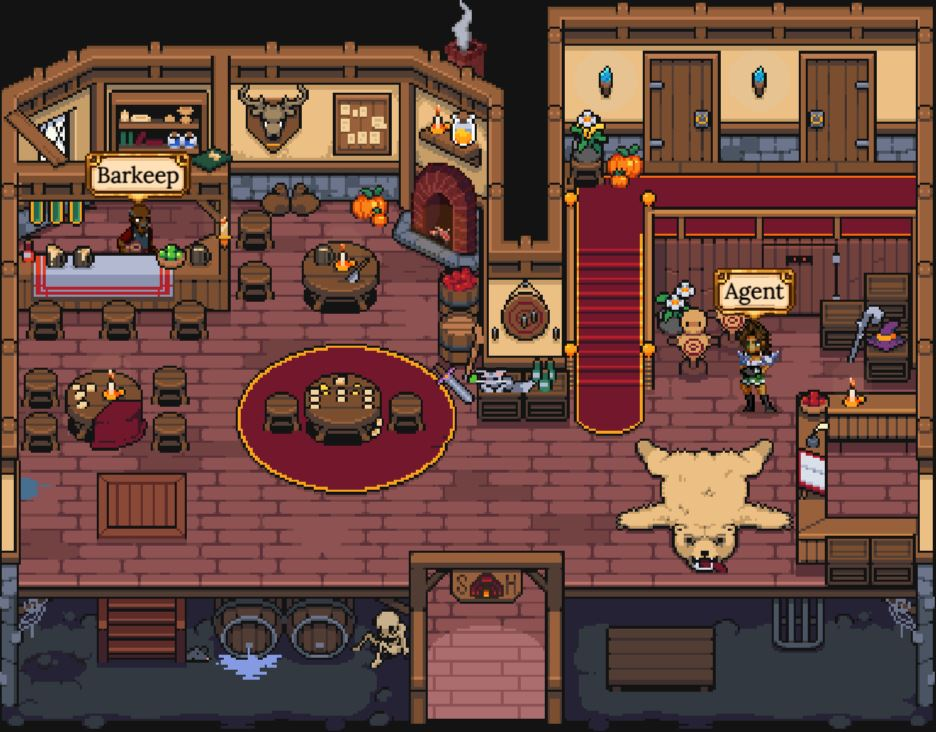

# Tavern

La **Tavern** è il luogo da visitare se desideri **acquistare** o **vendere** Eroi, **noleggiare** il tuo Eroe per evocare, **inviare** un Eroe ad un amico o visualizzare il **Catalogo Eroi**.

Il Barkeep Kessing ti consente di visualizzare ogni singolo Eroe per numero di #ID, o di visualizzare il catalogo completo degli eroi. Inoltre, offre la funzione "**Invia Eroe (Send Hero)**" che ti consente di inviare un Eroe direttamente ad un indirizzo 0x, a condizione che a tale indirizzo sia associato un profilo DeFi Kingdoms.

L'Agent Selina ospita le funzioni "**Compra Eroe (Buy Hero)**" e "**Vendi Eroe (Sell Hero)**", che consentono ai giocatori di mettere in vendita i loro Eroi e di acquistare gli Eroi che altri giocatori offrono in vendita. Tutte le vendite sono definitive, quindi è imperativo ricontrollare quali Eroi stai mettendo in vendita e il prezzo che sei disposto ad accettare.

Inoltre, l'Agent Selina ha un'opzione "**Offri Eroi a Noleggio (List Hero for Hire)**", che consente ai giocatori di affittare i propri Eroi da usare nelle [Evocazioni](heroes/summoning.md). Come nota aggiuntiva, se desideri noleggiare un Eroe da usare per la tua Evocazione, puoi farlo attraverso il menu dell'Arch Druid, al [Portal](portal.md).

Tutti questi menù includono una varietà di filtri per facilitare la ricerca del tipo preciso di Eroe che stai cercando.
