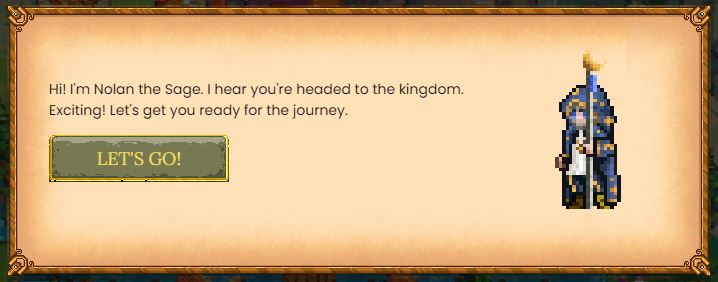

# Come Cominciare

DeFi Kingdoms è un gioco basato su browser, quindi tutto ciò di cui hai bisogno per configurare il tuo sistema è un browser compatibile con l'estensione MetaMask.

Il [tutorial](https://defikingdoms.com/tutorial.html) di DeFi Kingdoms ti guida attraverso il download di un browser compatibile e l'installazione dell'estensione MetaMask.

Inoltre, avrai bisogno dei token ONE nella Harmony Mainnet per le commissioni del gas e per convertirli in JEWEL all'interno del gioco. Il [tutorial](https://defikingdoms.com/tutorial.html) fornisce anche ulteriori informazioni sull'acquisto di token Harmony ONE. In generale, dovrai trovare uno Exhange come Binance, Crypto.com o Kucoin che scambi ONE, quindi dovrai inviare ONE al tuo portafoglio MetaMask.

Una volta che avrai configurato il tuo browser e MetaMask, ed avrai un po' di Harmony ONE nel tuo portafoglio, sarai in grado di entrare nel gioco. Puoi fare un tour delle varie zone della mappa per saperne di più sul gioco. Puoi leggere questi documenti per avere informazioni approfondite su una moltitudine di argomenti.

Mentre esplori, probabilmente avrai molte domande. La sezione [Gameplay](gameplay/) offre molte informazioni e potresti trovare ciò di cui hai bisogno anche nella sezione [FAQ](faq.md). Inoltre, il posto migliore per discussioni e supporto in tempo reale è nel nostro server[ Discord DFK](https://discord.com/invite/defikingdoms), o sulla [Community Italiana](https://discord.gg/Fh3H7CMdbS). I collegamenti a questo e ad altri nostri siti di social media possono essere trovati sulla nostra [homepage](https://defikingdoms.com) o nella sezione [contatti](../important/contatti/).
